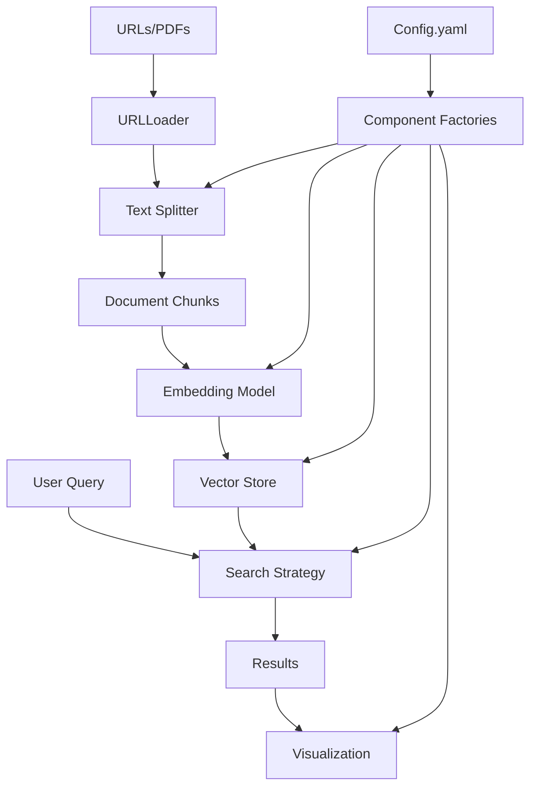

# Experimental RAG Framework Documentation

## Table of Contents
- [Description](#description)
- [Installation](#installation)
- [System Architecture](#system-architecture)
- [Configuration Reference](#configuration-reference)
- [Extending the Framework](#extending-the-framework)
- [Usage Examples](#usage-examples)

## Description

The Experimental RAG Framework is a modular and configurable Retrieval Augmented Generation (RAG) application designed for running experiments with various RAG components and settings. The framework provides a flexible architecture for:

- Loading content from multiple sources (URLs, PDFs)
- Splitting text using different strategies (sentence transformers, recursive character, spaCy)
- Generating embeddings using various models (HuggingFace, FastEmbed)
- Storing vectors with Chroma DB
- Implementing hybrid search combining vector similarity and BM25
- Visualizing search results and document comparisons

The application is built with extensibility in mind, allowing researchers and developers to easily swap components and experiment with different configurations.

## Installation

### Prerequisites

1. Python 3.12
2. Poetry for dependency management

### Setup Steps

1. Install Poetry:
```bash
curl -sSL https://install.python-poetry.org | python3 -
```

2. Clone the repository and install dependencies:
```bash
git clone [repository-url]
cd scratch-rag-application
poetry install
```

3. Install spaCy language model:
```bash
poetry run python -m spacy download en_core_web_sm
```

4. Create required directories:
```bash
mkdir -p logs visualizations chroma_db
```

## System Architecture

### Class Diagram

```mermaid
classDiagram
    class BaseTextSplitter {
        <<abstract>>
        +split_documents()
        #_create_splitter()
    }
    class BaseEmbedding {
        <<abstract>>
        +embed_documents()
        +embed_query()
        #_create_embedder()
    }
    class BaseVectorStore {
        <<abstract>>
        +add_documents()
        +similarity_search()
        +update_document()
        +delete()
    }
    class BaseSearch {
        <<abstract>>
        +search()
        #_initialize_search()
    }
    class BaseVisualization {
        <<abstract>>
        +visualize()
    }
    
    BaseTextSplitter <|-- MarkdownDocumentSplitter
    BaseTextSplitter <|-- RecursiveDocumentSplitter
    BaseTextSplitter <|-- SentenceTransformerDocumentSplitter
    BaseTextSplitter <|-- SpacyDocumentSplitter
    
    BaseEmbedding <|-- HuggingFaceEmbedding
    BaseEmbedding <|-- FastEmbedEmbedding
    
    BaseVectorStore <|-- ChromaVectorStore
    
    BaseSearch <|-- VectorSearch
    BaseSearch <|-- BM25Search
    BaseSearch <|-- HybridSearch
    
    BaseVisualization <|-- MatplotlibVisualization
    BaseVisualization <|-- DocumentComparisonVisualization
    
    class ConfigHandler {
        +get()
        +get_all_paths()
    }
    
    class TextSplitterFactory {
        +create_splitter()
    }
    class EmbeddingFactory {
        +create_embedder()
    }
    class VectorStoreFactory {
        +create_store()
    }
    class SearchFactory {
        +create_searcher()
    }
    class VisualizationFactory {
        +create_visualizer()
    }
```



### Information Flow Diagram



## Configuration Reference

| Variable Name | Description | Used In Class |
|--------------|-------------|---------------|
| pipeline.sources.website.urls | List of URLs to fetch content from | URLLoader |
| pipeline.sources.website.content_class | HTML class containing relevant content | URLLoader |
| text_splitter.type | Type of text splitter to use (markdown/recursive_character/sentence_transformer/spacy) | TextSplitterFactory |
| text_splitter.sentence_transformer.chunk_size | Size of text chunks in tokens | SentenceTransformerDocumentSplitter |
| text_splitter.sentence_transformer.chunk_overlap | Overlap between chunks | SentenceTransformerDocumentSplitter |
| text_splitter.sentence_transformer.model_name | Model for tokenization | SentenceTransformerDocumentSplitter |
| embeddings.type | Type of embedding model (huggingface/fastembed) | EmbeddingFactory |
| embeddings.huggingface.model_name | HuggingFace model for embeddings | HuggingFaceEmbedding |
| embeddings.huggingface.model_kwargs | Model configuration parameters | HuggingFaceEmbedding |
| embeddings.fastembed.model_name | FastEmbed model name | FastEmbedEmbedding |
| embeddings.fastembed.max_length | Maximum sequence length | FastEmbedEmbedding |
| vectorstore.type | Type of vector store (currently only chroma) | VectorStoreFactory |
| vectorstore.chroma.persist_directory | Directory for storing vectors | ChromaVectorStore |
| vectorstore.chroma.collection_name | Name of the vector collection | ChromaVectorStore |
| scoring.type | Search strategy (hybrid/bm25/vector) | SearchFactory |
| scoring.parameters.k | Number of results to return | BaseSearch |
| scoring.hybrid.bm25_weight | Weight for BM25 scores in hybrid search | HybridSearch |
| scoring.hybrid.vector_weight | Weight for vector scores in hybrid search | HybridSearch |

## Extending the Framework

The framework is designed for easy extension through its factory pattern implementation. Here's how to add new components:

### Adding a New Text Splitter

1. Create a new splitter class inheriting from BaseTextSplitter:
```python
from .base_splitter import BaseTextSplitter

class CustomSplitter(BaseTextSplitter):
    def _create_splitter(self):
        return YourSplitterImplementation(
            chunk_size=self.params.get("text_splitter.custom.chunk_size", 1000),
            chunk_overlap=self.params.get("text_splitter.custom.chunk_overlap", 200)
        )
```

2. Register the splitter in TextSplitterFactory:
```python
class TextSplitterFactory:
    _splitters = {
        "custom": CustomSplitter,  # Add your splitter
        # existing splitters...
    }
```

3. Update config.yaml:
```yaml
text_splitter:
  type: "custom"
  custom:
    chunk_size: 1000
    chunk_overlap: 200
```

### Adding a New Search Strategy

1. Create a new search class inheriting from BaseSearch:
```python
from .base_search import BaseSearch

class CustomSearch(BaseSearch):
    def _initialize_search(self):
        # Initialize your search implementation
        pass

    def search(self, query: str, k: Optional[int] = None):
        # Implement search logic
        pass
```

2. Register in SearchFactory:
```python
class SearchFactory:
    _searchers = {
        "custom": CustomSearch,  # Add your search strategy
        # existing strategies...
    }
```

## Usage Examples

### Basic Query
```bash
python main.py --query "What is API authentication?"
```

### Reload Data and Query
```bash
python main.py --reload-data --query "What is API authentication?"
```

### Query with Visualization
```bash
python main.py --query "What is API authentication?" --visualize relevance_score
```

### Inspect Vector Store
```bash
python main.py --inspect
```
